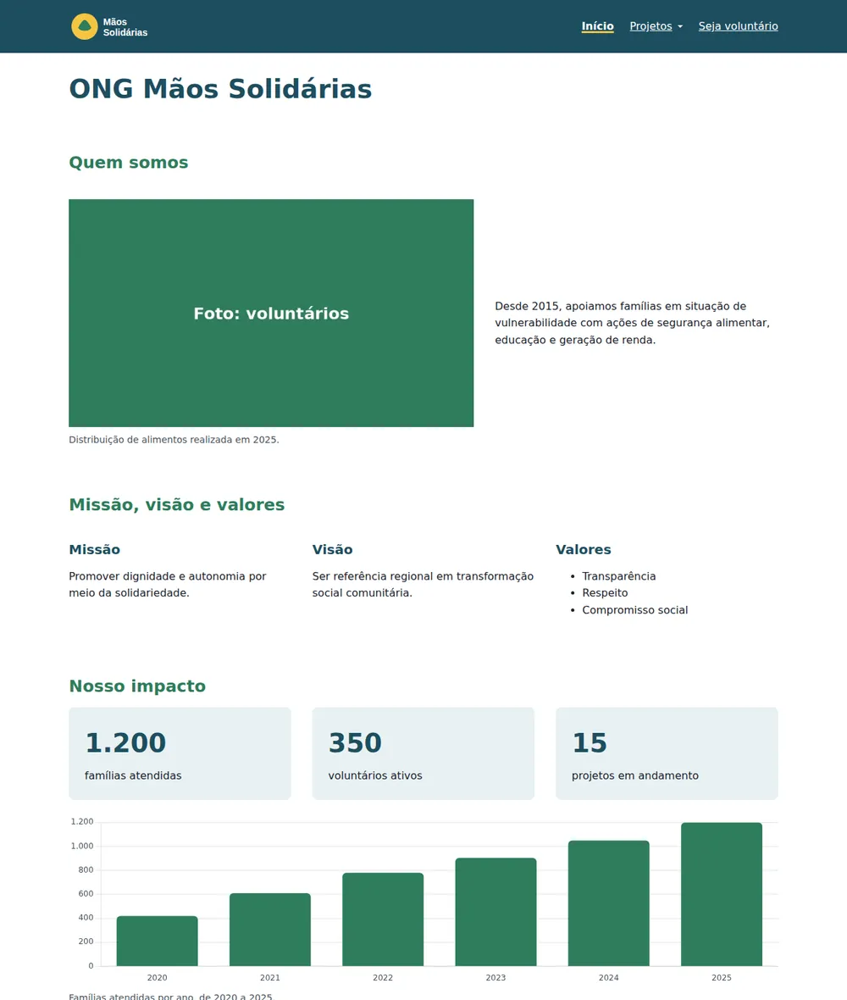
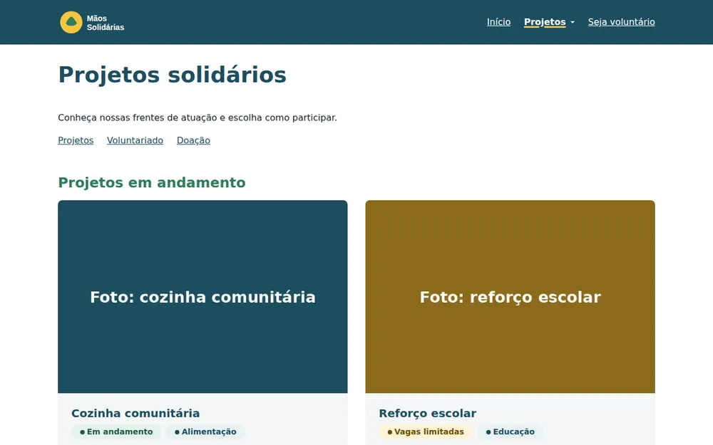
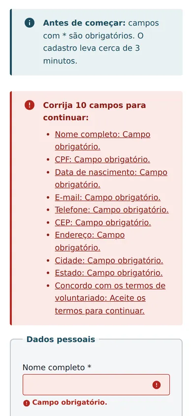
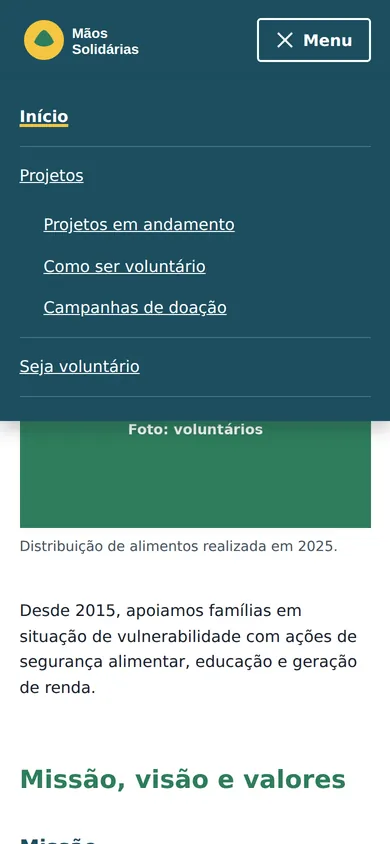

# ONG Mãos Solidárias

[](https://github.com/murillosezerino/ong-maos-solidarias/actions/workflows/deploy.yml)


Single Page Application para uma organização do terceiro setor divulgar seus projetos, captar doações e cadastrar voluntários. Feita com HTML, CSS e JavaScript puros, sem frameworks, com foco em acessibilidade, código modular e desempenho.

**Acesse:** https://murillosezerino.github.io/ong-maos-solidarias/

## Sumário
- [Demonstração](#demonstração)
- [Funcionalidades](#funcionalidades)
- [Tecnologias](#tecnologias)
- [Acessibilidade](#acessibilidade)
- [Pré-requisitos](#pré-requisitos)
- [Instalação e execução local](#instalação-e-execução-local)
- [Scripts disponíveis](#scripts-disponíveis)
- [Testes](#testes)
- [Build e deploy](#build-e-deploy)
- [Estrutura do projeto](#estrutura-do-projeto)
- [Arquitetura](#arquitetura)
- [Versionamento e contribuição](#versionamento-e-contribuição)
- [Licença](#licença)
- [Autor](#autor)

## Demonstração

| Página inicial (desktop) | Projetos (desktop) |
|---|---|
|  |  |

| Validação do cadastro (celular) | Menu responsivo (celular) |
|---|---|
|  |  |

> As fotos dos projetos são imagens ilustrativas.

## Funcionalidades
- **Navegação SPA:** troca de páginas sem recarregar, com suporte aos botões voltar e avançar, título da aba atualizado e página de "não encontrada".
- **Cadastro de voluntários:** máscaras de CPF, telefone e CEP; validação de CPF pelos dígitos verificadores, idade mínima de 18 anos e nome completo; mensagens por campo e resumo de erros com links para cada campo.
- **Persistência local:** cadastros e rascunho do formulário salvos no `localStorage`, com o CPF armazenado parcialmente oculto.
- **Projetos e doações:** cartões gerados a partir de dados, campanha com barra de progresso e modal com a chave Pix e botão de copiar.
- **Gráfico de impacto:** famílias atendidas por ano com Chart.js e tabela alternativa caso a biblioteca não carregue.
- **Modo escuro e alto contraste:** botões no rodapé, preferência do sistema respeitada automaticamente e suporte ao modo de cores forçadas do Windows.
- **Componentes de feedback:** badges, alertas, toasts e modal, documentados na página *Guia de componentes*.

## Tecnologias
| Área | Tecnologias |
|---|---|
| Estrutura | HTML5 semântico, `<dialog>`, ARIA |
| Estilo | CSS3 com variáveis (design system), Grid de 12 colunas, Flexbox, 5 breakpoints *mobile first* |
| Comportamento | JavaScript ES2020+ com ES Modules, Template Literals, Fetch API, Web Storage, Clipboard API |
| Biblioteca | [Chart.js 4.5](https://www.chartjs.org/) via CDN com Subresource Integrity |
| Build | [esbuild](https://esbuild.github.io/) e Node.js |
| Testes | `node:test` (executor nativo do Node.js) |
| CI/CD | GitHub Actions e GitHub Pages |

## Acessibilidade
O projeto segue a **WCAG 2.1 nível AA**. A auditoria com axe-core não aponta violações em nenhuma rota, e a revisão manual cobre navegação por teclado, contraste, reflow em 320px e leitores de tela. Destaques: modo escuro e alto contraste com todas as combinações acima de 4,5:1, link para pular ao conteúdo, foco levado ao título a cada troca de página, erros associados aos campos por `aria-describedby` e respeito à preferência por menos movimento.

Detalhes, problemas encontrados e correções: [ACESSIBILIDADE.md](ACESSIBILIDADE.md).

## Pré-requisitos
- [Git](https://git-scm.com/)
- [Node.js](https://nodejs.org/) **20 ou superior** (inclui o npm)
- Um navegador atualizado (Chrome, Edge, Firefox ou Safari)

## Instalação e execução local
```bash
# 1. Clone o repositório
git clone https://github.com/murillosezerino/ong-maos-solidarias.git
cd ong-maos-solidarias

# 2. Instale as dependências de desenvolvimento
npm install

# 3. Inicie o servidor local
npm run dev
```
Acesse http://localhost:3000.

> A aplicação usa módulos JavaScript e carrega as páginas com `fetch`, por isso **precisa de um servidor**: abrir o `index.html` direto pelo explorador de arquivos não funciona. Também é possível usar a extensão Live Server do VS Code.

## Scripts disponíveis
| Comando | O que faz |
|---|---|
| `npm run dev` | Serve o código-fonte em http://localhost:3000 |
| `npm test` | Executa os testes unitários |
| `npm run build` | Gera a versão otimizada na pasta `dist/` |
| `npm run preview` | Serve a pasta `dist/` em http://localhost:4173 |

## Testes
```bash
npm test
```
Os testes ficam em `tests/` e cobrem as funções puras da aplicação: validação de CPF e cálculo de idade, máscaras de entrada, ocultação do CPF e templates (incluindo o escape de HTML contra injeção de código). Eles também rodam automaticamente no GitHub Actions antes de cada deploy.

## Build e deploy
```bash
npm run build
npm run preview
```
O build une os 15 módulos JavaScript em um único arquivo minificado, une os 4 arquivos CSS em um, remove comentários e espaços das páginas e copia as imagens. A primeira carga cai de **26 para 9 requisições**.

O deploy é automático: a cada push na branch `main`, o workflow [`deploy.yml`](.github/workflows/deploy.yml) instala as dependências, executa os testes, gera o build e publica a pasta `dist/` no GitHub Pages.

## Estrutura do projeto
```
ong-maos-solidarias/
├── index.html            # Shell da SPA: cabeçalho, menu, <main> e rodapé
├── html/                 # Views carregadas pelo roteador
├── css/
│   ├── variaveis.css     # Design system: cores, tipografia e espaçamentos
│   ├── base.css          # Estilos dos elementos HTML
│   ├── layout.css        # Grid e Flexbox
│   └── componentes.css   # Menu, formulário, feedback e gráfico
├── js/
│   ├── app.js            # Ponto de entrada
│   ├── router.js         # Roteamento por hash
│   ├── paginas/          # Lógica de cada página
│   ├── modulos/          # Menu, máscaras, validação, armazenamento, feedback e gráficos
│   ├── templates/        # Funções que geram HTML a partir de dados
│   └── dados/            # Dados dos projetos e do gráfico
├── imagens/              # SVG, WebP e JPG
├── tests/                # Testes unitários
├── scripts/build.mjs     # Script de build
└── .github/              # Workflow de deploy e modelos de issue e PR
```

## Arquitetura
- **Roteamento por hash** (`#/projetos`): funciona em qualquer hospedagem estática sem configurar o servidor. O roteador busca a view em `html/`, injeta no `<main>` e chama a função `iniciar()` da página.
- **Módulos em camadas:** `app.js` → `router.js` → `paginas/` → `modulos/`, `templates/` e `dados/`. As camadas de baixo não importam as de cima, evitando dependências circulares.
- **Infraestrutura isolada:** apenas `armazenamento.js` acessa o `localStorage` e apenas `graficos.js` conhece o Chart.js, o que facilita trocar o armazenamento por uma API no futuro.

## Versionamento e contribuição
- **Fluxo de branches (GitFlow):** `main` recebe apenas versões estáveis; `develop` integra o desenvolvimento; novas funcionalidades nascem em `feature/*`; lançamentos passam por `release/*` e correções urgentes por `hotfix/*`.
- **Commits:** padrão [Conventional Commits](https://www.conventionalcommits.org/pt-br/) (`feat`, `fix`, `docs`, `test`, `build`, `ci`, `chore`).
- **Versões:** [versionamento semântico](https://semver.org/lang/pt-BR/), com tags e releases no GitHub e histórico no [CHANGELOG.md](CHANGELOG.md).
- **Pull requests e issues:** toda funcionalidade é integrada por PR, ligada a uma issue e a um milestone. Há modelos de issue e de PR em `.github/`.

Para contribuir:
```bash
git checkout develop
git checkout -b feature/minha-funcionalidade
# ... alterações ...
npm test
git commit -m "feat: descreve a funcionalidade"
git push -u origin feature/minha-funcionalidade
```
Depois, abra um pull request para a branch `develop`.

## Licença
Distribuído sob a licença MIT. Veja [LICENSE](LICENSE).

## Autor
**Murillo Sezerino**
[GitHub](https://github.com/murillosezerino) · [LinkedIn](https://www.linkedin.com/in/murillosezerino) · [Portfólio](https://murillosezerino.com)
